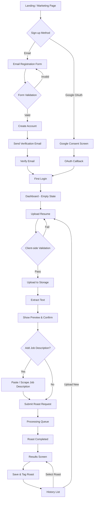

# User Flow: Sign-up → Upload → Roast Results → History

**Key Notes**
- Verification required before first dashboard access for email users.
- Client-side validation covers file type/size and job description length.
- History provides entry point for re-opening past results or starting new roast.
